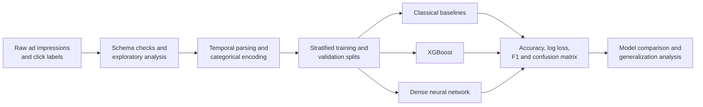

<div align="center">

# Ad Click-Through Rate Prediction

**Large-scale binary classification for estimating click propensity across millions of ad impressions.**

[](https://www.python.org/)
[](https://xgboost.ai/)
[](https://www.tensorflow.org/)
[](https://jupyter.org/)

</div>

## Overview

This project builds an end-to-end click-through rate (CTR) prediction workflow for anonymized digital-ad impressions. It transforms high-cardinality categorical and temporal fields into model-ready features, compares classical and neural approaches, and evaluates their ability to estimate whether an impression will produce a click.

The experiments cover:

- exploratory analysis and feature preprocessing;
- stratified train/validation splits;
- Random Forest and linear baselines;
- tuned XGBoost classifiers;
- dense neural networks with batch normalization and dropout;
- evaluation with accuracy, log loss, F1, classification reports, and confusion matrices.

## Results at a glance

| Experiment | Accuracy | Log loss | F1 score |
| --- | ---: | ---: | ---: |
| XGBoost, 4M-sample validation | **83.53%** | **0.3943** | **0.7803** |
| Dense neural network, 4M-sample evaluation | 83.36% | 0.4047 | 0.7776 |
| XGBoost, shifted holdout notebook | 63.00% | 0.6374 | 0.6755 |
| Neural network, shifted holdout notebook | 62.76% | 0.6071 | 0.6739 |

- **Best recorded 4M result:** tuned XGBoost delivered the strongest balance of classification quality and probability calibration.
- **Neural-network result:** a regularized multilayer network closely matched XGBoost, but did not improve log loss.
- **Distribution sensitivity:** performance dropped materially on the separate holdout workflow, highlighting the importance of temporal splits, drift monitoring, and probability calibration in production CTR systems.

> [!IMPORTANT]
> Metrics above are taken from saved notebook outputs. The underlying training data is not distributed in this repository, so the experiments have not been independently rerun from source. Results from different sampling workflows are shown separately and should not be treated as directly comparable benchmarks.

## Modeling workflow



## Feature engineering

The source schema contains a click label plus anonymized impression context such as hour, banner position, site and app identifiers, device attributes, and additional categorical fields.

The preprocessing notebook:

1. separates numerical and categorical features;
2. extracts useful information from the timestamp-like `hour` field;
3. encodes categorical variables and scales selected numerical fields;
4. uses Random Forest importance and correlation analysis to identify redundant features;
5. removes identifier-like and highly correlated fields before modeling;
6. creates stratified train and validation datasets.

## Model experiments

### Classical baselines

`Training_basic_models.ipynb` compares several conventional classifiers and establishes a baseline for the nonlinear models. `RandomForest.py` contains a standalone Random Forest experiment with probability-based log-loss evaluation.

### XGBoost

The XGBoost notebooks use randomized hyperparameter search and evaluate predicted probabilities as well as thresholded classifications. This is important for CTR use cases, where well-ranked and well-calibrated probabilities are often more valuable than raw accuracy alone.

### Neural network

The dense network stacks fully connected layers with batch normalization and progressively reduced dropout. Model checkpoints preserve the best validation state, while the test notebook evaluates the saved network on a separate holdout workflow.

## Repository guide

| Path | Purpose |
| --- | --- |
| `ai_ml_project_pre_processing_final.ipynb` | Data inspection, encoding, temporal features, feature selection, and train/validation export |
| `Training_basic_models.ipynb` | Baseline model comparison on a reduced sample |
| `Training_4M_xgb.ipynb` | Tuned XGBoost experiment on the 4M-sample workflow |
| `Training_4M_NN.ipynb` | Regularized dense neural network on the 4M-sample workflow |
| `Training_Max_xgb.ipynb` | XGBoost experiment under the alternate maximum-data sampling setup |
| `Training_Max_NN.ipynb` | Neural-network experiment under the alternate sampling setup |
| `test_Xgb.ipynb` | XGBoost evaluation on a separate holdout dataset |
| `Test_Neural_Net.ipynb` | Saved neural-network checkpoint evaluation |
| `RandomForest.py` | Standalone Random Forest baseline |
| `NN_checkpoint_best_model.h5` | Saved neural-network checkpoint from the original experiment |

## Running the project

The original notebooks were developed in Google Colab and reference datasets under `/content/drive/MyDrive/AI ML Project/`. To adapt them:

1. create a Python 3.10 environment and install the dependencies;
2. place your own compatible impression datasets in a local data directory;
3. replace the Colab Drive paths with your local paths;
4. run preprocessing before the model-training notebooks;
5. preserve a time-aware holdout set when the data spans multiple periods.

```bash
python -m venv .venv
source .venv/bin/activate  # Windows: .venv\Scripts\activate
pip install -r requirements.txt
jupyter lab
```

The raw data is intentionally excluded. Expected fields include an impression ID, binary `click` target, hour, banner position, site/app attributes, device attributes, and anonymized categorical features.

## Limitations and next steps

- The source dataset is unavailable, preventing turnkey reproduction.
- Several notebooks rely on intermediate CSV files and Colab-specific paths.
- Random train/validation splits can overestimate performance when ad traffic changes over time.
- Accuracy can be misleading for imbalanced click labels; log loss, PR-AUC, ROC-AUC, and calibration should be tracked together.
- The saved `.h5` checkpoint should eventually be versioned with model metadata and a reproducible training configuration.
- A production iteration should add temporal validation, categorical embeddings or native categorical boosting, calibration curves, drift checks, and experiment tracking.

## Project context

This repository preserves the original academic machine-learning experiments and their recorded outputs while adding documentation for portfolio review. No private training data or credentials are included.
